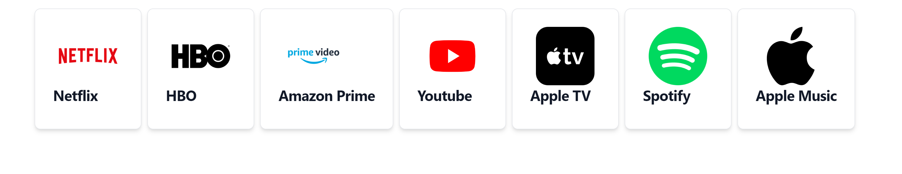

# Subscriptions tracker

### This project help to track your subscriptions. 
### It helps to track and predict your spendings on subscriptions.

#### Created with:
##### Front-end:
- React
- Redux
- Tailwind CSS

##### Back-End:
- Express.js
- PostgreSQL
- Sequilize
- dayjs

**Implemented authorization and authentification:**

**Sign-up page**

**Sign-in page**

**Main page**

**Add new subscription page**
**At first, you choose a company:**

**And after create new subscription:**

 